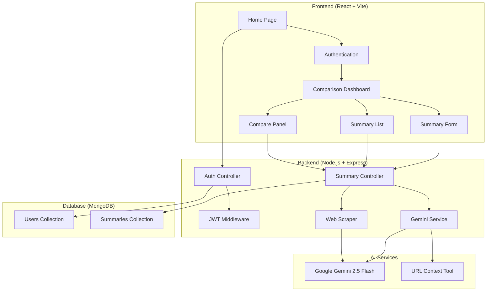
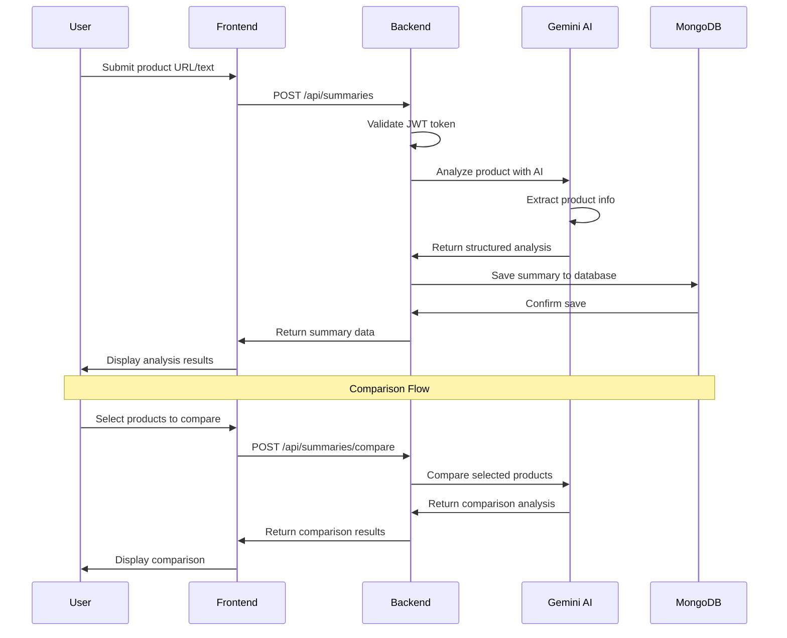

# AI Shopping Companion

A comprehensive MERN stack application that leverages AI to help users analyze, summarize, and compare products from various sources. Built with React frontend, Node.js/Express backend, MongoDB database, and Google Gemini AI integration.

## Github Link: https://github.com/simrandora10/CompareAI

# Video Link: https://drive.google.com/file/d/1pX2NpwKn7XmsXocBb9wGmOuS_43YPo48/view?usp=sharing

## 🚀 Features

- **User Authentication**: Secure JWT-based authentication system
- **Product Analysis**: AI-powered product summarization from URLs or text descriptions
- **Smart Comparison**: Intelligent product comparison with recommendations
- **History Management**: Persistent storage of product analyses and comparisons
- **Modern UI**: Responsive design with dark mode support
- **Real-time Processing**: Live AI analysis with loading states

## 🏗️ Architecture Overview



## 📊 Data Flow Diagram



## 🛠️ Technology Stack

### Frontend

- **React 19.1.1** - Modern UI framework
- **Vite 7.1.7** - Fast build tool and dev server
- **Tailwind CSS 4.1.13** - Utility-first CSS framework
- **Radix UI** - Accessible component primitives
- **React Router DOM 7.9.2** - Client-side routing
- **Motion** - Animation library
- **React Markdown** - Markdown rendering

### Backend

- **Node.js** - JavaScript runtime
- **Express 4.18.2** - Web framework
- **MongoDB 7.3.1** - NoSQL database
- **Mongoose 7.3.1** - MongoDB object modeling
- **JWT** - JSON Web Token authentication
- **bcrypt** - Password hashing
- **CORS** - Cross-origin resource sharing

### AI Integration

- **Google Gemini 2.5 Flash** - Primary AI model
- **@google/genai 1.20.0** - Official Gemini SDK
- **URL Context Tool** - Web page analysis
- **Cheerio** - Server-side HTML parsing
- **Axios** - HTTP client for web scraping

### Development Tools

- **ESLint** - Code linting
- **Nodemon** - Development server
- **sanitize-html** - Input sanitization

## 📁 Project Structure

```
CompareAI/
├── backend/
│   ├── config/
│   │   └── gemini.js          # Gemini API configuration
│   ├── controllers/
│   │   ├── authController.js  # Authentication logic
│   │   └── summaryController.js # Product analysis logic
│   ├── models/
│   │   ├── User.js           # User data model
│   │   └── Summary.js        # Summary data model
│   ├── routes/
│   │   ├── auth.js           # Authentication routes
│   │   └── summaries.js      # Summary routes
│   ├── utils/
│   │   ├── authMiddleware.js  # JWT authentication middleware
│   │   ├── geminiService.js   # AI service integration
│   │   └── scraper.js         # Web scraping utilities
│   ├── server.js             # Express server setup
│   └── package.json          # Backend dependencies
├── frontend/
│   ├── src/
│   │   ├── components/
│   │   │   ├── CompareComponents/
│   │   │   │   ├── ComparePanel.jsx    # Product comparison UI
│   │   │   │   ├── Navbar.jsx         # Navigation component
│   │   │   │   ├── SummaryForm.jsx    # Product input form
│   │   │   │   └── SummaryList.jsx    # Summary display list
│   │   │   ├── ui/                    # Reusable UI components
│   │   │   ├── ComparisonPage.jsx     # Main comparison interface
│   │   │   ├── HomePage.jsx          # Landing page
│   │   │   ├── Login-page.jsx        # Login interface
│   │   │   └── signup-form.jsx       # Registration form
│   │   ├── hooks/
│   │   │   └── use-outside-click.jsx # Custom React hook
│   │   ├── lib/
│   │   │   ├── api.js                # API client utilities
│   │   │   └── utils.js              # General utilities
│   │   ├── App.jsx                   # Main app component
│   │   └── main.jsx                  # App entry point
│   └── package.json                  # Frontend dependencies
└── README.md                        # This file
```

## 🗄️ Database Design

### Collections Schema

#### Users Collection

```javascript
{
  _id: ObjectId,
  name: String (required),
  email: String (required, unique),
  passwordHash: String (required),
  settings: Mixed (default: {}),
  createdAt: Date (default: Date.now)
}
```

#### Summaries Collection

```javascript
{
  _id: ObjectId,
  userId: ObjectId (ref: "User", required),
  sourceUrl: String,
  rawInput: String,
  extracted: Mixed (default: {}),
  aiSummary: [String] (default: []),
  aiMetadata: {
    model: String,
    timestamp: Date,
    inputType: String
  },
  tags: [String] (default: []),
  createdAt: Date (default: Date.now)
}
```

### Database Indexes

```javascript
// Performance optimization indexes
summarySchema.index({ userId: 1, createdAt: -1 }); // User summaries by date
summarySchema.index({ "extracted.title": "text", aiSummary: "text" }); // Full-text search
```

## 🔧 Setup Instructions

### Prerequisites

- Node.js (v18 or higher)
- MongoDB (local installation or MongoDB Atlas)
- Google Gemini API key

### Backend Setup

1. **Navigate to backend directory**

   ```bash
   cd backend
   ```

2. **Install dependencies**

   ```bash
   npm install
   ```

3. **Environment Configuration**

   ```bash
   cp .env.example .env
   ```

   Configure the following variables in `.env`:

   ```env
   MONGO_URI=mongodb://localhost:27017/ai-shopping-companion
   JWT_SECRET=your-super-secret-jwt-key
   GEMINI_API_KEY=your-gemini-api-key
   PORT=5000
   ```

4. **Start MongoDB**

   ```bash
   # Local MongoDB
   mongod --dbpath /data/db

   # Or use Docker
   docker run -d -p 27017:27017 --name mongodb mongo:latest
   ```

5. **Start the backend server**
   ```bash
   npm run dev
   ```

### Frontend Setup

1. **Navigate to frontend directory**

   ```bash
   cd frontend
   ```

2. **Install dependencies**

   ```bash
   npm install
   ```

3. **Environment Configuration**
   Create `.env.local` file:

   ```env
   VITE_API_BASE=http://localhost:5000/api
   ```

4. **Start the development server**

   ```bash
   npm run dev
   ```

5. **Access the application**
   Open [http://localhost:5173](http://localhost:5173) in your browser

## 🤖 AI Integration Details

### Google Gemini 2.5 Flash Integration

The application uses Google's Gemini 2.5 Flash model for product analysis and comparison. Key features:

- **URL Context Tool**: Direct web page analysis without manual scraping
- **Structured Prompts**: Consistent markdown-formatted responses
- **Fallback Mechanism**: Web scraping backup for URL analysis
- **Error Handling**: Graceful degradation with user-friendly messages

### AI Model Trade-offs

| Model                       | Pros                                   | Cons                               | Use Case                  |
| --------------------------- | -------------------------------------- | ---------------------------------- | ------------------------- |
| **Google Gemini 2.5 Flash** | Fast, cost-effective, URL context tool | Newer API, limited fine-tuning     | Production-ready analysis |
| **OpenAI GPT-4**            | Mature, highly accurate                | Higher cost, slower                | Premium analysis features |
| **HuggingFace Models**      | Open source, customizable              | Requires hosting, setup complexity | Custom domain models      |

### Current Implementation Benefits

- **Cost Efficiency**: Gemini Flash provides excellent value for money
- **Speed**: Fast response times for real-time analysis
- **Reliability**: Built-in URL context tool reduces scraping failures
- **Scalability**: Google's infrastructure handles high loads

## 🔒 Security Features

### Input Sanitization

- **HTML Sanitization**: Using `sanitize-html` library
- **Input Validation**: Server-side validation for all inputs
- **XSS Protection**: Content Security Policy headers

### Authentication Security

- **JWT Tokens**: Secure token-based authentication
- **Password Hashing**: bcrypt with salt rounds
- **Token Expiration**: 7-day token lifetime
- **CORS Configuration**: Restricted cross-origin requests

### API Security

- **Rate Limiting**: Prevents abuse (can be added)
- **Request Validation**: Comprehensive input validation
- **Error Handling**: Secure error messages without data leakage

## 🚀 Production Readiness Considerations

### Scalability Improvements

1. **Caching Layer**

   ```javascript
   // Redis implementation for summary caching
   const redis = require("redis");
   const client = redis.createClient();

   // Cache frequently accessed summaries
   app.get("/api/summaries/:id", async (req, res) => {
     const cached = await client.get(`summary:${req.params.id}`);
     if (cached) return res.json(JSON.parse(cached));
     // ... fetch from database
   });
   ```

2. **Database Optimization**

   - Implement connection pooling
   - Add read replicas for scaling
   - Consider sharding for large datasets

3. **Load Balancing**
   - Use PM2 for process management
   - Implement horizontal scaling
   - Add health check endpoints

### Monitoring & Logging

1. **Application Monitoring**

   ```javascript
   // Add Winston logging
   const winston = require("winston");
   const logger = winston.createLogger({
     level: "info",
     format: winston.format.json(),
     transports: [
       new winston.transports.File({ filename: "error.log", level: "error" }),
       new winston.transports.File({ filename: "combined.log" }),
     ],
   });
   ```

2. **Performance Monitoring**

   - Implement APM tools (New Relic, DataDog)
   - Add response time tracking
   - Monitor AI API usage and costs

3. **Error Tracking**
   - Integrate Sentry for error monitoring
   - Set up alerting for critical failures
   - Implement circuit breakers for AI services

### Security Enhancements

1. **Advanced Security**

   ```javascript
   // Add helmet for security headers
   const helmet = require("helmet");
   app.use(helmet());

   // Rate limiting
   const rateLimit = require("express-rate-limit");
   const limiter = rateLimit({
     windowMs: 15 * 60 * 1000, // 15 minutes
     max: 100, // limit each IP to 100 requests per windowMs
   });
   app.use("/api/", limiter);
   ```

2. **Data Protection**
   - Implement data encryption at rest
   - Add audit logging for sensitive operations
   - Regular security audits and penetration testing

## 🔮 Future Improvements

### Enhanced AI Features

- **Multi-model Support**: Integrate multiple AI providers for comparison
- **Custom Model Training**: Fine-tune models on product-specific data
- **Real-time Price Tracking**: Monitor price changes across retailers
- **Sentiment Analysis**: Analyze customer reviews and ratings

### Advanced Functionality

- **Product Categories**: Specialized analysis for different product types
- **Wishlist Integration**: Save products for future comparison
- **Price Alerts**: Notifications for price drops
- **Social Features**: Share comparisons with friends

### Technical Enhancements

- **Progressive Web App**: Offline functionality and push notifications
- **GraphQL API**: More efficient data fetching
- **Microservices Architecture**: Scalable service separation
- **Container Deployment**: Docker and Kubernetes deployment

### User Experience

- **Mobile App**: Native iOS and Android applications
- **Voice Interface**: Voice-activated product analysis
- **AR Integration**: Augmented reality product visualization
- **Personalization**: AI-powered recommendation engine

## 📊 Performance Metrics

### Current Benchmarks

- **AI Analysis Time**: 2-5 seconds average
- **Database Query Time**: <100ms for summary retrieval
- **Frontend Load Time**: <2 seconds initial load
- **API Response Time**: <500ms for most endpoints

### Optimization Targets

- **AI Analysis**: <3 seconds (95th percentile)
- **Database**: <50ms query time
- **Frontend**: <1.5 seconds initial load
- **API**: <300ms response time

## 🧪 Testing Strategy

### Unit Testing

```javascript
// Example test structure
describe("Summary Controller", () => {
  test("should create summary with valid input", async () => {
    const mockInput = "iPhone 15 Pro Max";
    const result = await createSummary({ body: { input: mockInput } });
    expect(result.success).toBe(true);
  });
});
```

### Integration Testing

- API endpoint testing with Jest and Supertest
- Database integration tests
- AI service mocking for consistent testing

### End-to-End Testing

- Cypress for frontend user flows
- API contract testing
- Cross-browser compatibility testing

## 📝 API Documentation

### Authentication Endpoints

#### POST `/api/auth/register`

Register a new user account.

**Request Body:**

```json
{
  "name": "John Doe",
  "email": "john@example.com",
  "password": "securepassword"
}
```

**Response:**

```json
{
  "user": {
    "id": "user_id",
    "name": "John Doe",
    "email": "john@example.com"
  },
  "token": "jwt_token"
}
```

#### POST `/api/auth/login`

Authenticate user and return JWT token.

**Request Body:**

```json
{
  "email": "john@example.com",
  "password": "securepassword"
}
```

### Summary Endpoints

#### POST `/api/summaries`

Create a new product summary.

**Headers:**

```
Authorization: Bearer <jwt_token>
```

**Request Body:**

```json
{
  "input": "https://amazon.com/product-url or product description text"
}
```

**Response:**

```json
{
  "success": true,
  "data": {
    "_id": "summary_id",
    "userId": "user_id",
    "rawInput": "input_text",
    "aiSummary": "markdown_analysis",
    "aiMetadata": {
      "model": "gemini-2.5-flash",
      "timestamp": "2024-01-01T00:00:00.000Z",
      "inputType": "url"
    },
    "createdAt": "2024-01-01T00:00:00.000Z"
  }
}
```

#### GET `/api/summaries`

Retrieve all summaries for authenticated user.

#### POST `/api/summaries/compare`

Compare multiple product summaries.

**Request Body:**

```json
{
  "ids": ["summary_id_1", "summary_id_2", "summary_id_3"]
}
```

## 🤝 Contributing

1. Fork the repository
2. Create a feature branch (`git checkout -b feature/amazing-feature`)
3. Commit your changes (`git commit -m 'Add amazing feature'`)
4. Push to the branch (`git push origin feature/amazing-feature`)
5. Open a Pull Request

### Development Guidelines

- Follow ESLint configuration
- Write comprehensive tests
- Update documentation for new features
- Follow conventional commit messages

## 📄 License

This project is licensed under the MIT License - see the [LICENSE](LICENSE) file for details.

## 🙏 Acknowledgments

- **Google Gemini Team** - For providing excellent AI capabilities
- **Radix UI** - For accessible component primitives
- **Tailwind CSS** - For the utility-first CSS framework
- **React Team** - For the amazing frontend framework

---

**Built with ❤️ using the MERN stack and AI technology**
